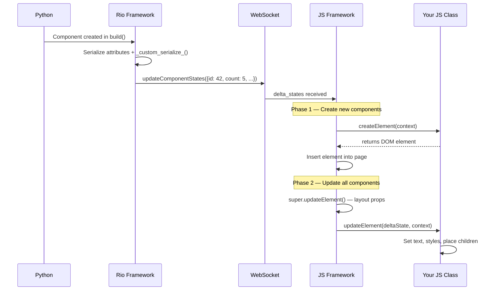
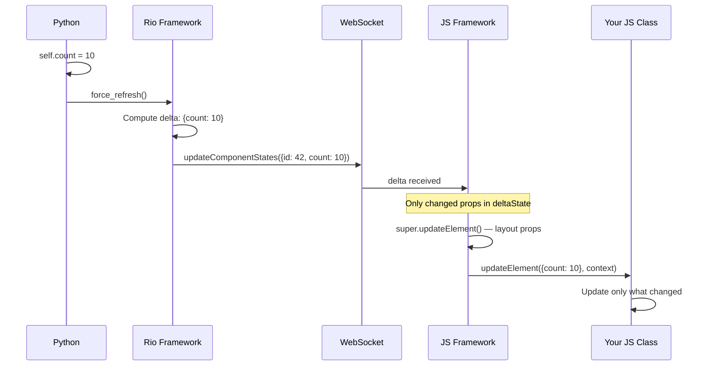
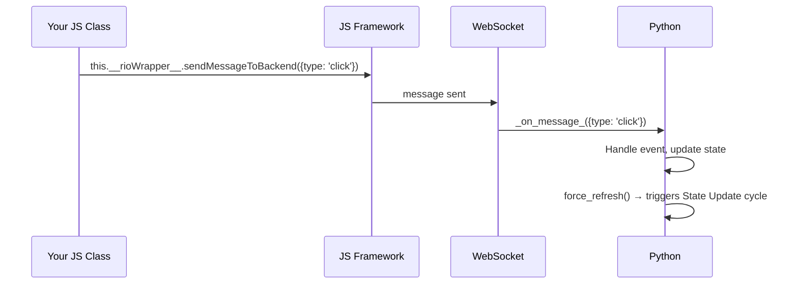

# HybridComponent Lifecycle

Visual reference for how Python and JS communicate in a HybridComponent.
See [HYBRID_COMPONENTS_GUIDE.md](HYBRID_COMPONENTS_GUIDE.md) for the full tutorial.

## First Render

## State Update

## JS → Python Message

